<style type="text/css">
code {
  background-color:darkred;
  color:pink;
  padding:4px;
  border-radius:8px;
  font-size:0.9em;
}
.demi {
  font-size:0.5em;
} 
.do {
  color:DarkOrange;
}
.zerosept {
  font-size:0.7em;
}
</style>

<!-- .slide: data-background="https://64.media.tumblr.com/ae9b5152f55e9d30f64d9e7433840363/tumblr_mwv6cczLEo1six59bo1_500.gif" -->

#### Prendre des notes et rédiger en [Markdown](https://wikipedia.fr) {style=color:black;background-color:coral;opacity:0.7;border-radius:9px;padding:3px;font-family:monospace,perpetua,mistral,gadugi,rockwell,papyrus;font-size:.8em;width:75%;text-align:center;margin-left:auto;margin-right:auto;}

Obsidian -- Zettlr -- ♥ Pandoc ♥ -- (*et Zotero*) {style=color:coral;font-size:.6em;font-family:monospace;opacity:0.7;}


UPPA -- *Service Commun de la Documentation*  
\<-- Formation des usagers --> {style=font-size:0.5em;color:deeppink;background-color:lightpink;opacity:.6;border-radius:15px;padding:3px;;width:42%;text-align:center;margin-left:auto;margin-right:auto;border-style:solid;border-color:lightpink;border-width:2px;}

Julien Rabaud (*Service d'appui à la recherche*)  
julien.rabaud@univ-pau.fr | [@ujubib](https://twitter.com/ujubib)  
v.2021.09 {style=font-size:0.5em;color:coral;background-color:;border-radius:15px;padding:3px;;width:42%;text-align:center;margin-left:auto;margin-right:auto;border-style:solid;border-color:coral;border-width:2px;opacity:.7;}

<aside class="notes">

- Bonjour
- Je me présente
- Tour de table :
  - Pourquoi êtes-vous là ?
  - Avec quoi prenez-vous des notes ?
  - Avec quoi rédigez-vous ?
  - Utilisez-vous Zotero ?
  - Quel est votre éditeur de texte favori ?
</aside>

--

##### +++ Liens envoyés avant la présentation +++ {style=color:DeepPink}

- Sarah Simpkin : [*Getting Started with Markdown*](https://doi.org/10.46430/phen0046) - The Programming Historian, novembre 2015, mise à jour mai 2020. {.demi}
  - en français : [*Débuter avec Markdown*](https://programminghistorian.org/fr/lecons/debuter-avec-markdown).
  - en castillan : [*Introducción a Markdown*](https://programminghistorian.org/es/lecciones/introduccion-a-markdown).

- Émilien Ruiz : [*Apprendre à écrire ?*](http://www.boiteaoutils.info/2020/04/apprendre-ecrire/) -  La boîte à outils des historien·ne·s, avril 2020. {.demi}
- Éliane Caillou : [*"Stylo" : l'éditeur de texte SHS d'Huma-Num*](https://cometdoc.hypotheses.org/1147) - com&doc, novembre 2020. {.demi}
- Sur [Le blog d'Arthur Perret](https://www.arthurperret.fr/) (*doctorant en SIC à Bordeaux*) : {.demi}
  - [L’écriture académique au format texte](https://www.arthurperret.fr/2021-09-21-ecriture-academique-format-texte.html), septembre 2021 (*Notes de la formation (2h) qu’il a animé à l’URFIST de Bordeaux le 21 septembre 2021*). 
  - [*Écrire et éditer*](https://www.arthurperret.fr/ecrire-et-editer.html), mai 2020.
  - [*Enseignement et automatisation avec Pandoc*](https://www.arthurperret.fr/enseignement-automatisation-pandoc.html), novembre 2020.
  - [*Recommandation : Zettlr*](https://www.arthurperret.fr/recommandation-zettlr.html), septembre 2019.


--

##### +++ Autres liens +++ {style=color:DeepPink}

- Tennen D. & Wythoff G. : [*Sustainable Authorship in Plain Text using Pandoc and Markdown*](https://programminghistorian.org/en/lessons/sustainable-authorship-in-plain-text-using-pandoc-and-markdown) - The Programming Historian, mars 2014, mise à jour juillet 2020. {.demi}
  - en français : [*Rédaction durable avec Pandoc et Markdown*](https://programminghistorian.org/fr/lecons/redaction-durable-avec-pandoc-et-markdown)
  - en castillan : [*Escritura sostenible en texto plano usando Pandoc y Markdown*](https://programminghistorian.org/es/lecciones/escritura-sostenible-usando-pandoc-y-markdown)

- [*Les fabriques de publication*](https://www.quaternum.net/2020/04/29/les-fabriques-de-publication/), Série de fiches sur le *Carnet* de [quaternum.net
](https://www.quaternum.net/), le site d'Antoine Fauchié. {.demi}
  - [*Fabriques de publication :* [2] *Pandoc*](https://www.quaternum.net/2020/04/30/fabriques-de-publication-pandoc/) *(30 avril 2020)*
  - [*Fabriques de publication :* [8] *Stylo*](https://www.quaternum.net/2020/05/21/fabriques-de-publication-stylo/) *(21 mai 2020)*
  - [*Fabriques de publication :* [9] *Zettlr*](https://www.quaternum.net/2020/08/28/fabriques-de-publication-zettlr/) *(28 août 2020)*
  
- Sur [Le blog de Hendrik Herz](https://www.hendrik-erz.de/blog) (*le doctorant qui développe Zettlr*) {.demi}
  - [*How I work* [IV] : *Reference Management & Reading Literature*](https://www.hendrik-erz.de/blog)
  - [*How I work* [V] : *Zettlr and Academic Markdown*](https://www.hendrik-erz.de/post/how-i-work-part-v-zettlr-and-academic-markdown)
- [Academic Pandoc template](https://maehr.github.io/academic-pandoc-template/markdown.html) : Pour comprendre certaines options de Pandoc. {.demi}

- [Mentions du format Markdown](http://www.these.robindemourat.com/glossary/69fc8e7f-a5ca-4d78-8367-b92cf8f9a480) dans la thèse (*Esthétique et Arts appliqués*, Rennes, 2020) de Robin de Mourat : *Le Vacillement des formats. Matérialité, écriture et enquête : le design des publications en Sciences Humaines et Sociales*. {.demi}

--

<!-- .slide: data-background="https://64.media.tumblr.com/tumblr_lugnruHFez1qfvnxro1_1280.jpg" -->

### Déroulé {style=color:DeepPink}

- **Généralités**, histoire, définitions [→](#/2) {.do}
- *Markdown*, syntaxe et **saveurs** [→](#/3) {.do}
- **Prendre des notes** en *Markdown* [→](#/4) {.do}
- **Rédiger** en *Markdown* [→](#/5) {.do}
- Et ***Zotero*** dans tout ça... [→](#/6) {.do}
- La magie ***Pandoc*** [→](#/7) {.do}
- Extensions (*diaporama*, *diagrammes*, *mindmap*) [→](#/8) {.do}

---

<!-- .slide: data-background="https://64.media.tumblr.com/tumblr_lyfuwzuR0K1qh3ft3o1_500.gif" -->

## Généralités, définitions {style=color:DeepPink}

--

#### Fichiers binaires, fichiers textes {style=color:DeepPink;text-align:left;}

- **Fichiers binaires** : nécessitent un logiciel spécifique pour être lus et édités : {.fragment .fade-left style=font-size:0.8em;}
  - `.docx`, `.odt`, `.pdf`

- **Fichiers textes** : lisibles et modifiables dans un simple éditeur de texte : {.fragment .fade-left style=font-size:0.8em;}
  - `.md`, `.html`, `.tex`, `.rst`...

<aside class="notes">

dézipper un document word

</aside>

--

#### Markdown {style=color:DeepPink;text-align:left;margin-left:2em}

> **Markdown** est un langage de balisage léger créé en 2004 par John Gruber avec l'aide d'Aaron Swartz. Il a été créé dans le but d'offrir une syntaxe facile à lire et à écrire. Un document balisé par Markdown peut être lu en l'état sans donner l’impression d'avoir été balisé ou formaté par des instructions particulières. {style=background-color:pink;color:darkred;text-align:justify;font-size:0.66em;padding:.5em}

Wikipedia (fr) : [Markdown](https://en.wikipedia.org/wiki/Markdown) {style=font-size:0.5em;text-align:right;margin-right:130px;}

***

\> [Le site de John Gruber](https://daringfireball.net/projects/markdown/) {style=font-size:0.6em;text-align:left;margin-left:150px;}

\> [Le billet du regretté Aaron Swartz](http://www.aaronsw.com/weblog/001189) {style=font-size:0.6em;text-align:left;margin-left:150px;}

***

#CultureNum : documentaire [The Internet's Own Boy: The Story of Aaron Swartz](https://peertube.mxinfo.fr/videos/watch/8b676d61-0be2-46e4-929f-27f482492f8b)  
(sous-titres en plusieurs langues disponibles) {style=font-size:0.4em;text-align:right;margin-right:130px;margin-left:150px;}


<aside class="notes">

Un petit mot sur Aaron Swartz
</aside>

--

#### Définitions {style=color:DeepPink;text-align:left;margin-left:8em}

- Structuration
- Balisage
- Feuille de style

---

<!-- .slide: data-background="https://64.media.tumblr.com/tumblr_ltyg0pGXaZ1qe6mn3o1_500.gif" -->

## Markdown, syntaxes et saveurs {style=color:DeepPink}

--

### Saveurs {style=color:DeepPink;text-align:left;margin-left:2em}

  - CommonMark (*ppdc*)
  - Github Flavored Markdown (GFM)
  - MultiMarkdown (*MacOS, révision*)
  - **Pandoc's Markdown**
  - Rmarkdown (`.rmd`)
  - ...

--

### Guides et tutoriels {style=color:DeepPink;text-align:left;}
  - intéractif : [Markdown Tutorial (multilingue)](https://markdowntutorial.com)
  - GFM : [Mastering Markdown](https://guides.github.com/features/mastering-markdown/)
  - [Markdown Guide](https://markdownguide.org) (*voir diapo suivante*)
  - Pandoc : [Pandoc’s Markdown](https://pandoc.org/MANUAL.html#pandocs-markdown)

--

### [Markdown Guide](https://markdownguide.org) {style=color:DeepPink;text-align:left;}

Le plus clair, complet(*) et synthétique. Contient :

- [Markdown Cheat Sheet](https://markdownguide.org/cheat-sheet)
- [Basic Syntax](https://markdownguide.org/basic-syntax)
- [Extended Syntax](https://markdownguide.org/extended-syntax)
- [Tools](https://markdownguide.org/tools)
<!-- -->

(\*) *Ne traite pas des références bibliographiques, spécificité de **Pandoc**.  
Voir [Manuel Pandoc, Citations](https://pandoc.org/MANUAL.html#citations)* {style=font-size:0.7em;color:hotpink}
--

#### Syntaxe `inline` {style=color:DeepPink;text-align:left;}

 markdown | html | affichage {style=font-size:0.8em;}
---|---|---
`*italique*` ou `_italique_`|`<em>italique</em>`|*italique* {.zerosept}
`**gras**`|`<strong>gras<strong>`|**gras** {.zerosept}
`***gras italique***`|`<strong><em>gras italique</em></strong>`|***gras italique*** {.zerosept}
`~~barré~~`|`<s>barré</s>`|~~barré~~ {.zerosept}
`XIX^e^`|`XIX<sup>e</sup>`|XIX<sup>e</sup> {.zerosept}
`H~2~O`|`H<sub>2</sub>O`|H<sub>2</sub>O {.zerosept}
`[texte](url)`|`<a href="url">texte</a>`|<a href="url">texte</a> {.zerosept}
`[texte]{.style}`|`<span class="style">texte</span>`|texte {.zerosept}
||
--

### Images {style=color:DeepPink;text-align:left;}

`{width=160px}` {style=font-size:0.7em;text-align:left;margin-left:2em}

{width=160px} {style=text-align:left;margin-left:2em}

`` {style=font-size:0.7em;text-align:left;margin-left:2em}


---

<!-- .slide: data-background="https://64.media.tumblr.com/tumblr_lxf7w0U1Qg1qdezf9o1_500.gif" -->

## Principes et outils pour prendre des notes en *Markdown* {style=color:DeepPink}

--

### Principes {style=color:DeepPink;text-align:left;}

Pas du markdown standard mais adoptés par tous ces outils (+ *Zettlr*) {style=text-align:left}

  - `#tags`
  - `[[wikilinks]]`
  - `- [ ]` To Do lists
  - *Templates* (dailynote, note de lecture...)

<aside class="notes">

Certaines de ces conventions existent dans certaines saveurs de Markdown.  
La ToDo List existe en GFM
</aside>

--

### Outils {style=color:DeepPink;text-align:left;margin-left:5em}

- [Obsidian.md](https://obsidian.md)
- *[Roam](https://roamresearch.com)'s likes* :
  - [Athens](https://github.com/athensresearch/athens/)
  - [Logseq](https://logseq.com)

--

Extensions pour *VS Code* {style=color:DeepPink;text-align:left;}
  - [Markdown Memo](https://github.com/svsool/vscode-memo) {.fragment .fade-left style=font-size:0.8em;}
    - \+ Markdown Link Updater
    - \+ Markdown Links (Vue en graphe)
  - [Dendron](https://wiki.dendron.so) {.fragment .fade-left style=font-size:0.8em;}
    - \+ Dendron Markdown Links
    - \+ Dendron Markdown Preview enhanced
    - \+ Markdown Link Updater
    - \+ ...

--

#### Obsidian.md

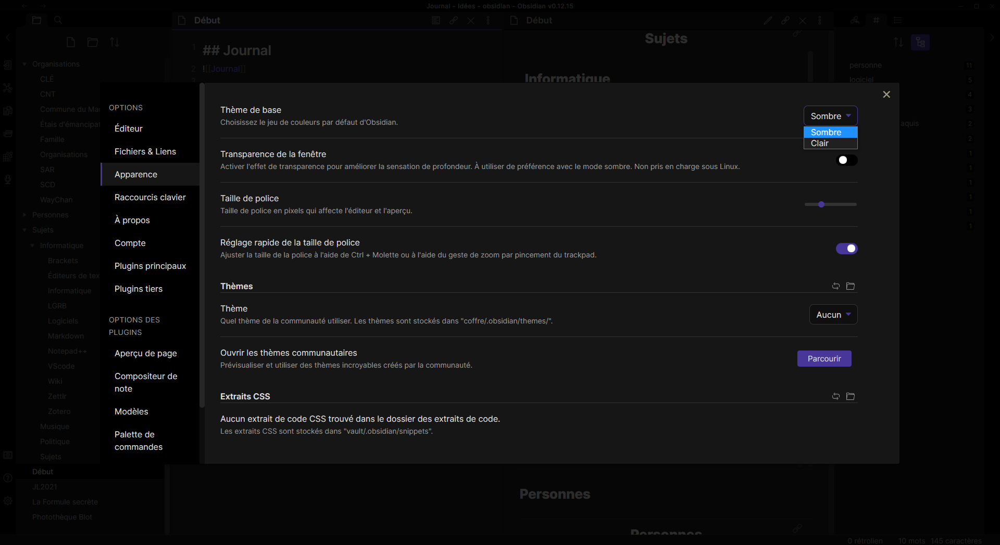

interface générale {style=font-size:.8em;}

<aside class="notes">

Pour les copies d'écran, une thème différent à chaque fois

ici : Sombre, Aucun Thème
</aside>

--

#### Obsidian.md


GraphView (Thème : *Pisum*) {style=font-size:.8em;}

<aside class="notes">

thème : 
</aside>

--

#### Obsidian.md


<aside class="notes">

thème : 
</aside>

--

#### Obsidian.md - plugins


<aside class="notes">

thème : 
</aside>

--

#### Obsidian.md - plugins


<aside class="notes">

thème : 
</aside>

--

#### Obsidian.md - plugins


<aside class="notes">

thème : 
</aside>

--

#### Obsidian.md - plugins


<aside class="notes">

thème : 
</aside>

--

#### Obsidian.md - plugins


<aside class="notes">

thème : 
</aside>

--

#### Obsidian.md - plugins


<aside class="notes">

thème : 
</aside>

---

<!-- .slide: data-background="https://64.media.tumblr.com/tumblr_m09wp6W0Af1qgfmnco1_500.gif" -->

## Rédiger en *Markdown* {style=color:DeepPink;}

--

#### éditeurs spécialisés (Recommandés) {style=color:DeepPink;text-align:left;}

- [Zettlr](https://www.zettlr.com/) {.fragment .fade-left}
  - [Chaîne YouTube](https://youtube.com/c/Zettlr)
  - [documentation en français](https://docs.zettlr.com/fr/)
  - \+ gestion intégrée de la bibliographie
- [Typora](https://typora.io) {.fragment .fade-left}
  - \+ confort d'écriture

--

##### [typora](https://typora.io/)

<table>
  <tr>
    <td style="text-align:center;line-height:6px;border-bottom:0px">
      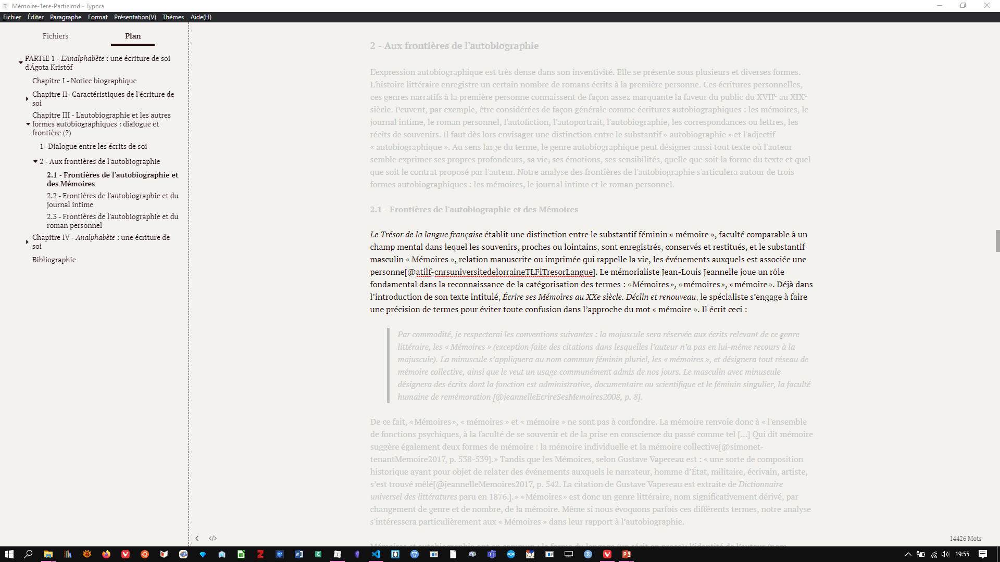<br/>
      <span style='font-size:0.5em'>Thème : <em>Newsprint</em> ; Modes <em>Focus</em> & <em>Typewriter</em></span>  
    </td>
    <td style="text-align:center;line-height:6px;border-bottom:0px">
      <br/>
      <span style='font-size:0.5em'>Mode <em>Code Source</em> [commenté]</span>
    </td>
  </tr>
  <tr>
    <td style="text-align:center;line-height:6px;border-bottom:0px">
      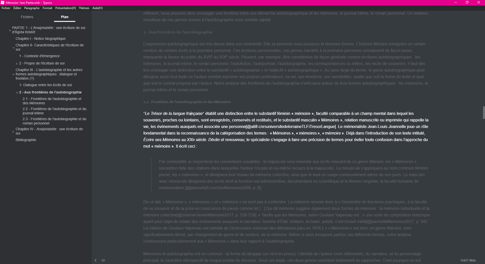<br/>
      <span style='font-size:0.5em'>Thème : <em>Night</em> ; Mode <em>Focus</em></span>
    </td>
    <td style="text-align:center;line-height:6px;border-bottom:0px">
      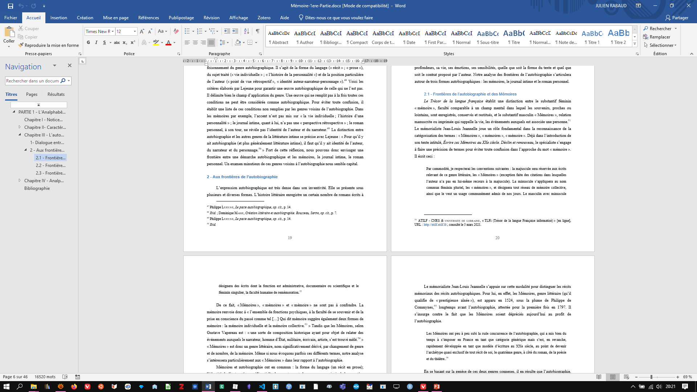<br/>
      <span style='font-size:0.5em'>Résultat dans Word (via Pandoc)</span>
    </td>
  </tr>
</table>

--

#### Liste d'éditeurs `Markdown` de Bureau {style=color:DeepPink;text-align:left;margin-left:4em;}

- [PanWriter](https://panwriter.com/) - <a href="img/panwriter.png">(aperçu)</a>
- [Abricotine](https://github.com/brrd/abricotine) - <a href="img/abricotine.png">(aperçu)</a>
- [Apostrophe](https://somas.pages.gitlab.gnome.org/apostrophe/)
- [Joplin](https://joplinapp.org/)
- [KeenWrite](https://github.com/DaveJarvis/keenwrite)
- [Markdown Monster](https://github.com/RickStrahl/MarkdownMonster) 
  - (*orienté blogging*)

--

#### Liste d'éditeurs `Markdown` En ligne {style=color:DeepPink;text-align:left;}

- [\_Stylo_](https://stylo.huma-num.fr/)
  - (Pour l'écriture d'articles scientifiques, hébergé chez [Huma-Num](https://stylo.huma-num.fr/)) {.demi}
  - M. Vitali-Rosati, « [Stylo : un éditeur de texte pour les sciences humaines et sociales](http://blog.sens-public.org/marcellovitalirosati/stylo/) », *Culture numérique*, 2018. {.demi}
- [Dillinger](https://dillinger.io/)
- [HackMD](https://hackmd.io/pricing) (*Collaboratif, inscription*) 
- [HedgeDoc](https://hedgedoc.org) (*Collaboratif, à installer sur un serveur*)
- [SlackEdit](https://stackedit.io)

--

#### éditeurs généralistes {style=color:DeepPink;text-align:left;margin-left:2em;}

- <span style="color:deeppink">**VS Code**</span> avec quelques extensions : {.demi}
  - Markdown Extension Pack : {.fragment .fade-left}
    - Markdown All in One
    - Markdown PDF
    - Mardown Image
    - markdownlint
    - Markdown Preview Github Style (*désinstallée*)
    - Grammarly (unofficial) (*english only*)
  - Pandoc Markdown Preview {.fragment .fade-left}
  - Markdown Footnote {.fragment .fade-left}
  - (Markdown Fiction Writer) {.fragment .fade-left}
  - ... {.fragment .fade-left}

--

- Rstudio (avec <span style="color:deeppink">**Rmarkdown**</span>)

  - [Tutoriel officiel (en)](https://rmarkdown.rstudio.com/lesson-1.html)
  - [Tutoriel de *Coding Club* (en)](https://ourcodingclub.github.io/tutorials/rmarkdown/)
  - [R Markdown : les rapports automatisés](http://larmarange.github.io/analyse-R/rmarkdown-les-rapports-automatises.html) - *analyse-R*

---

<!-- .slide: data-background="https://64.media.tumblr.com/e237e4f2c7476e7a1fc43c0f0df2f1ab/tumblr_oe21sjE4IN1qe6mn3o1_540.gif" -->

## Et Zotero dans tout ça... {style=color:DeepPink}

--

#### Extensions Zotero : [Better BibTeX for Zotero](https://retorque.re/zotero-better-bibtex/) {style=color:DeepPink;text-align:left;}

[Documentation pour Markdown/Pandoc](https://retorque.re/zotero-better-bibtex/exporting/pandoc/) {style=font-size:0.4em;text-align:left;margin-left:2em}

1- Exporte une collection Zotero dans un fichier `.json` ou `.bib` et garde le fichier synchronisé avec la collection. {style=color:DeepPink;font-size:0.4em;text-align:left;}

<table> 
  <tr>
  <td style="text-align:center;line-height:4px;border-bottom:0px">
      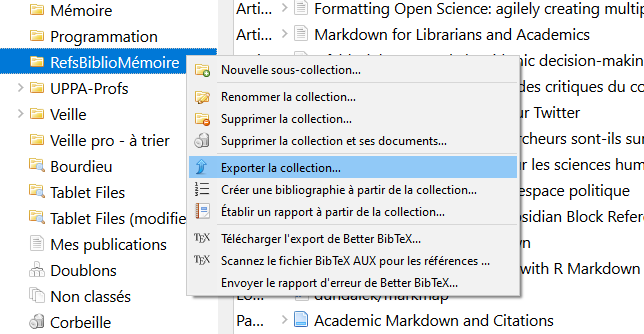<br/>
      <span style='font-size:0.3em;line-height:0.4em'>Mettre toute ses références dans une collection. <br>Puis clic-droit : <code style="padding:1px;border-radius:0px">Exporter la collection</code></span>
    </td>
    <td style="text-align:center;line-height:4px;border-bottom:0px">
      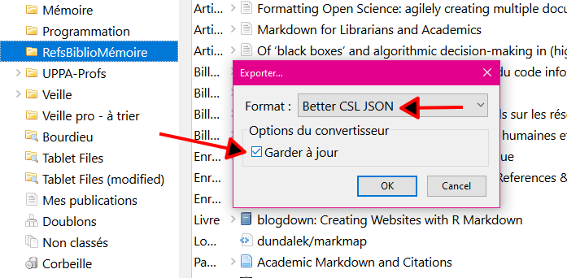<br/>
      <span style='font-size:0.3em;line-height:0.5em'>Choisir le format <code style="padding:1px;border-radius:0px">Better CSL JSON</code> ou <code style="padding:1px;border-radius:0px">Better BibTeX</code>...<br/>Et cocher <strong>Garder à jour</stron></span>
    </td>
    <td style="text-align:center;line-height:4px;border-bottom:0px">
      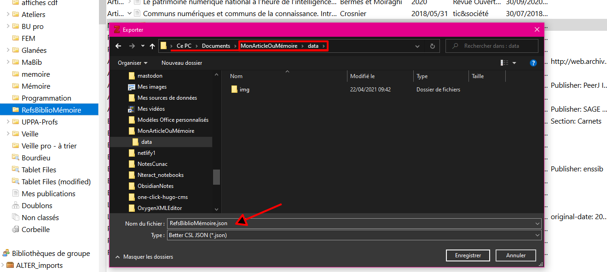<br/>
      <span style='font-size:0.3em;line-height:0.7em'>Exporter dans le dossier <code style="padding:1px;border-radius:0px">data</code> du répertoire d'écriture</span>
    </td>
  </tr>
</table> 

<hr style="border:none;border-top:3px dashed pink;width:95%;" />

2- Ajoute un convertisseur pour le *Quick Copy* (<kbd>ctrl</kbd>+<kbd>shift</kbd>+<kbd>c</kbd>) qui met dans le presse-papier `[@clédelaréf]` {style=color:DeepPink;font-size:0.4em;text-align:left;}

<table>
  <tr>
    <td style="text-align:center;line-height:4px;border-bottom:0px">
      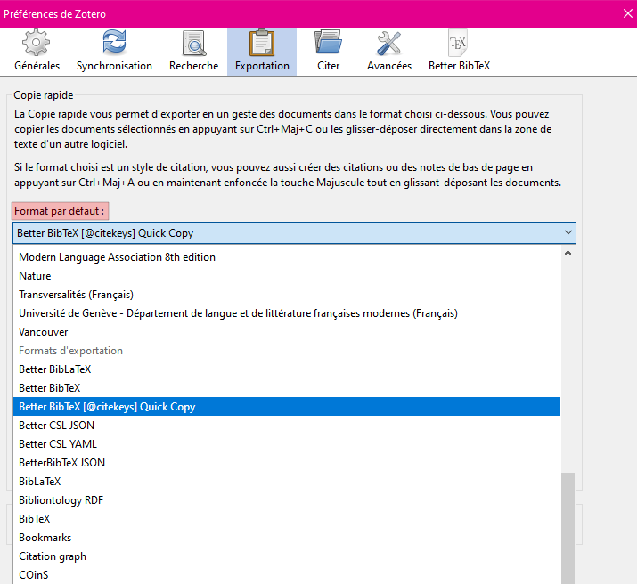<br/>
      <span style='font-size:0.3em;line-height:0.5em;'>Choisir <code style="padding:1px;border-radius:0px">Better BibTeX [@citekeys] Quick Copy</code> comme format de sortie par défaut</span>
    </td>
    <td style="text-align:center;line-height:4px;border-bottom:0px">
      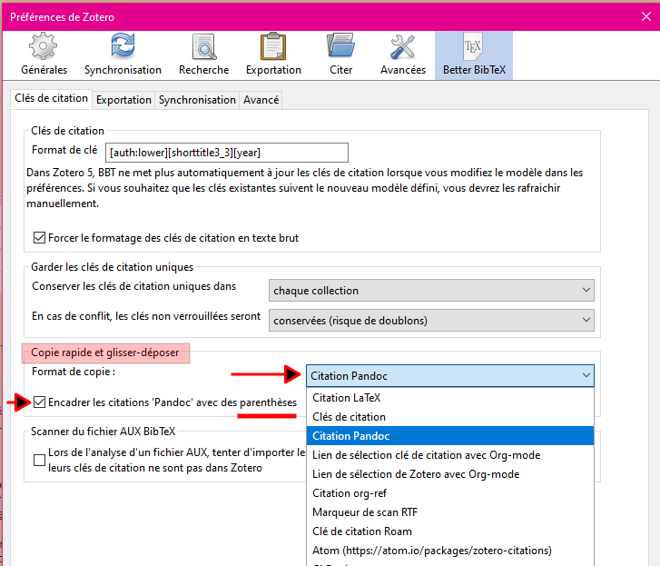<br/>
      <span style='font-size:0.3em;line-height:0.5em'>Paramétrage des préférences de BetterBibTeX</span>
    </td>
  </tr>
</table>

--

#### Extensions Zotero : [Mdnotes for Zotero](https://github.com/argenos/zotero-mdnotes) {style=color:DeepPink;text-align:left;}
  
Exporte en markdown (*vers un dossier, pour Obsidian, Zettlr ou autres*) {.demi}
- les **métadonnées** de la référence. {.demi}
- vos **notes** (qui peuvent avoir été extraites des pdf par [ZotFile](http://zotfile.com)). {.demi}
- Le [**tutoriel**](https://argentinaos.com/zotero-mdnotes/) officiel. {.demi}

<hr style="border:none;border-top:3px dashed pink;width:95%;" />

<table> 
  <tr>
  <td style="text-align:center;line-height:4px;border-bottom:0px">
      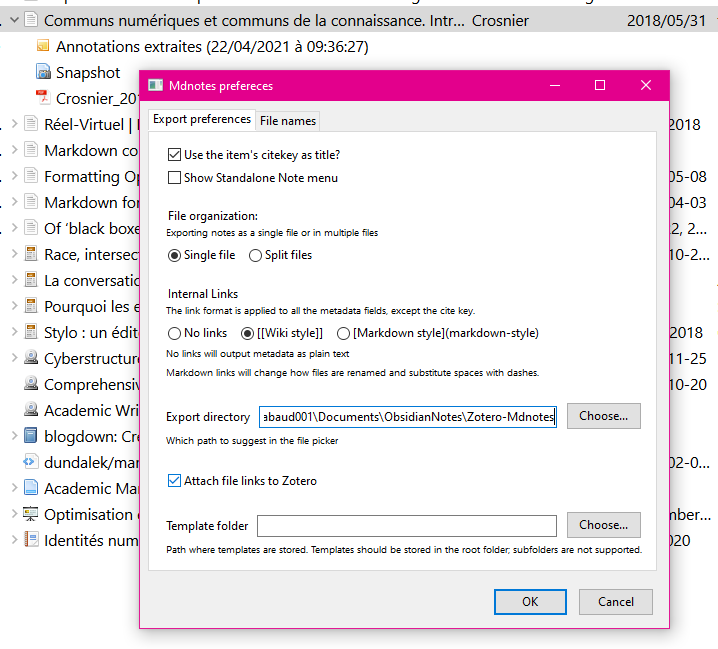<br/>
      <span style='font-size:0.3em;line-height:0.4em'>Zotero > Outils >  <strong>Mdnotes preferences</strong></span>
    </td>
    <td style="text-align:center;line-height:4px;border-bottom:0px">
      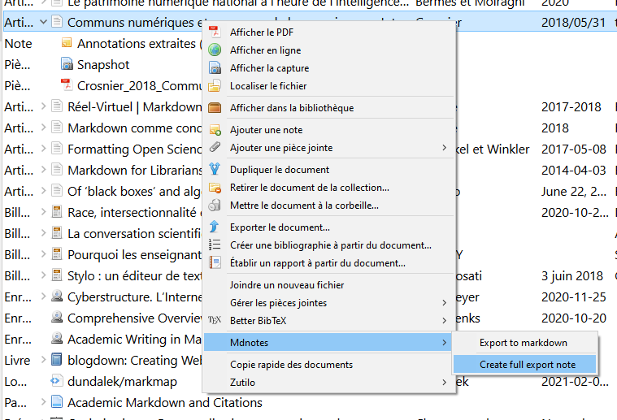<br/>
      <span style='font-size:0.3em;line-height:0.5em'>Clic-droit (sur une référence) > Mdnotes > Create full export note</span>
    </td>
    <td style="text-align:center;line-height:4px;border-bottom:0px">
      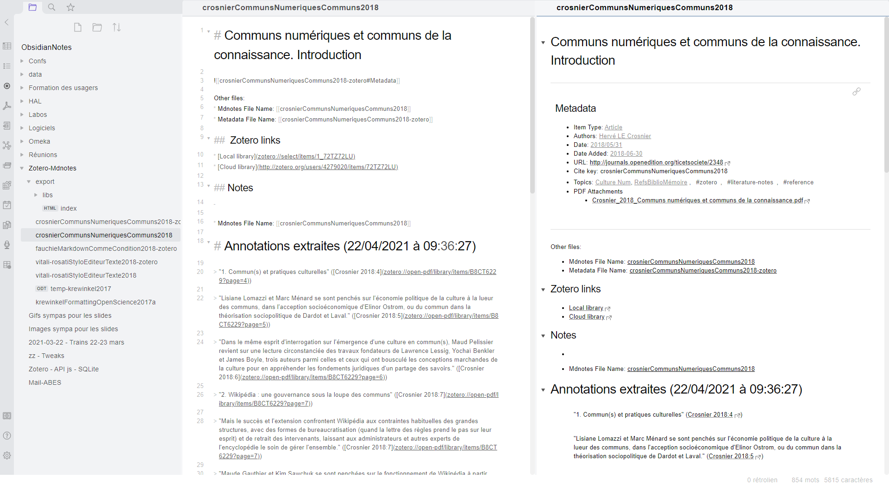<br/>
      <span style='font-size:0.3em;line-height:0.7em'>Résultat dans <strong>Obsidian</strong></span>
    </td>
  </tr>
</table> 


<aside class="notes">

*bientôt dépréciée ?* (Nouvelle version de Zotero)

</aside>

--

#### Extensions Zotero pour éditeurs {style=color:DeepPink;text-align:left;}

- **VS Code** : taper `Zotero` dans le gestionnaire de plugin

- **Obsidian** : sur le forum, [Zotero best practices](https://forum.obsidian.md/t/zotero-best-practices/164)

- Documentation **Zettlr** : [Citer avec Zettlr](https://docs.zettlr.com/fr/academic/citations/)

---

<!-- .slide: data-background="https://64.media.tumblr.com/tumblr_m77qqjH88d1rrj5i2o1_400.gif" -->

## La magie Pandoc {style=color:DeepPink}

--

Ressource indispensable : [Pandoc User’s Guide](https://pandoc.org/MANUAL.html) {style=font-size:0.6em;text-align:left;}

- [Listes des formats lus et écrits](https://pandoc.org/MANUAL.html#options) : `pandoc -f 'format' -t 'format'` (**f**rom, **t**o) {style=font-size:0.6em;text-align:left;}
- [Guide du markdown saveur Pandoc](https://pandoc.org/MANUAL.html#pandocs-markdown) {style=font-size:0.6em;text-align:left;}

Pour se familiariser avec les commandes : [Page d'exemples](https://pandoc.org/demos.html) {style=font-size:0.6em;text-align:left;}

--

Convertir une page web en fichier word (ou markdown) {style=font-size:0.6em;color:DeepPink}

```bash {style=font-size:0.9em;}
pandoc -r html https://fr.wikipedia.org/wiki/Aaron_Swartz -o AaronSwartz.docx

pandoc -r html https://fr.wikipedia.org/wiki/Aaron_Swartz -o AaronSwartz.md
```

--

markdown vers word, avec modèle et bibliographie {style=font-size:0.6em;color:DeepPink}

  ```bash
  pandoc 
    -s
    --reference-doc styleBraud.docx
    -C
    --bibliography=data/BiblioInventaire.json 
    --csl=data/gallia-prehistoire.csl
    -o mémoire.docx 
    mémoire.md
  ```

--

markdown vers html {style=font-size:0.6em;color:DeepPink}

avec bibliographie et sommaire (cliquables), template, css et javascript (ex: [Inventaire Blot](https://inventaire-blot.netlify.app/final2.html#ref-blotArcheologieMontagneBasque1993)) {style=font-size:0.6em;}
  ```
  pandoc 
    -s 
    --toc 
    --template=data/templateHtml.html 
    --include-in-header=data/css_mémoire.css 
    --include-in-header=data/js_mémoire.js 
    -C 
    --bibliography=data/BiblioInventaire.json 
    --csl=data/gallia-prehistoire.csl 
    --metadata link-citations=true 
    -o mémoire.html 
    mémoire.md
  ```

--

Une bonne porte d'entrée vers


```bash
pandoc -f markdown -t latex -o mémoire.tex mémoire.md
```

puis ouvrir avec un éditeur TeX ([Overleaf](https://www.overleaf.com) par exemple). {style=font-size:0.7em;}

---

<!-- .slide: data-background="https://64.media.tumblr.com/tumblr_ltc2swDWG11qcoo4bo1_500.gif" -->

## Extensions {style=color:DeepPink}

Diaporama, diagrammes, Mindmap {style=color:DeepPink}


--

Produire un **diaporama** : [Reveal.js](https://revealjs.com) {style=text-align:left;}
  
ou [Beamer](https://ctan.org/pkg/beamer) (*LaTeX, pdf*), [Slideous](https://goessner.net/articles/slideous/) (*html*), [Slidy](https://www.w3.org/Talks/Tools/Slidy2/#(1)) (*W3C, html*), [DZSlides](https://paulrouget.com/dzslides/) (*html*), [S5](https://meyerweb.com/eric/tools/s5/) (*html*) {style=text-align:left;margin-left:1em;font-size:0.6em}

Via **Pandoc** (comme Zettlr) ou extension VS Code : [vscode-reveal](https://github.com/evilz/vscode-reveal) {style=text-align:left;font-size:0.8em}

<aside class="notes">

Ce Diaporama a été réalisé avec [vscode-reveal](https://github.com/evilz/vscode-reveal)

</aside>

--

Dessiner des **Schémas et graphiques** : [Mermaid.js](https://mermaid-js.github.io/mermaid/#/) {style=text-align:left;}

  *[Flowchart](https://mermaid-js.github.io/mermaid/#/flowchart), [Sequence diagram](https://mermaid-js.github.io/mermaid/#/sequenceDiagram), [Class Diagram](https://mermaid-js.github.io/mermaid/#/classDiagram), [State Diagram](https://mermaid-js.github.io/mermaid/#/stateDiagram), [Entity Relationship Diagram](https://mermaid-js.github.io/mermaid/#/entityRelationshipDiagram), [User Journey](https://mermaid-js.github.io/mermaid/#/user-journey), [Gantt](https://mermaid-js.github.io/mermaid/#/gantt), [Pie Chart](https://mermaid-js.github.io/mermaid/#/pie)* {style=font-size:0.8em}
  - Zettlr et Typora : intégré {style=font-size:0.9em}
  - [Filtre Pandoc](https://github.com/timofurrer/pandoc-mermaid-filter) {style=font-size:0.9em}
  - VS Code : [Markdown Preview Mermaid Support](https://github.com/mjbvz/vscode-markdown-mermaid) {style=font-size:0.9em}

--

Dessiner des **graphiques** : [Draw.io Integration](https://github.com/hediet/vscode-drawio) dans **VS Code** (*support de mermaid*) {style=text-align:left;font-size:0.9em}
  


--

Vue MindMap : [Markmap.js](https://markmap.js.org) {style=text-align:left;font-size:0.8em}
  
extension Obsidian : [Obsidian Mind Map](https://github.com/lynchjames/obsidian-mind-map) | extension VS Code : [markmap-vscode](https://github.com/gera2ld/markmap-vscode) {style=font-size:0.6em}


---

<!-- .slide: data-background="https://64.media.tumblr.com/tumblr_luw9nk0Miu1qe6mn3o1_500.gif	" -->

## Merci de votre attention {style=color:DeepPink}


--

<!-- .slide: data-background="https://64.media.tumblr.com/tumblr_lwru10zDEl1qbxpeso1_500.jpg" -->

### Contact {style=color:DeepPink;text-align:left;}

- UPPA - Service Commun de la Documentation, BU de Pau :::
 <julien.rabaud@univ-pau.fr> ::: {style=color:DeepPink}
-  [@ujubib](https://twitter.com/ujubib) sur <a href='https://twitter.com/ujubib' target=_blank></a> {style=color:DeepPink}
