## Bonjour à tou·te·s

<p class="medpcenter" style="margin-top:60px;margin-bottom:0px;">Ingénieurs CNRS en sciences de l'information géographique</p>

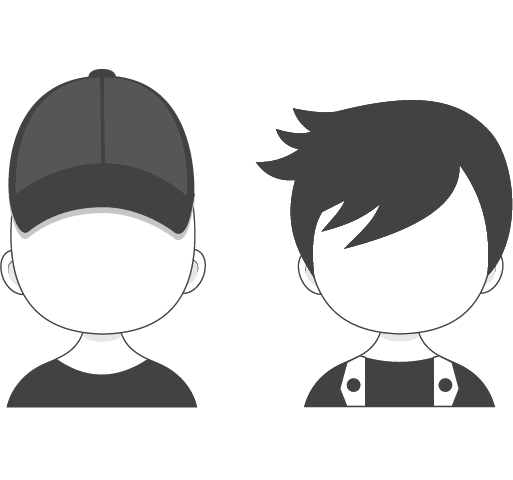


<div id="rightls">
<ul class="pucsmall22" style="margin-top:40px;">
> - Le langage R comme outil principal
> - Production régulière de notebook R
> - Responsables du projet Rzine
</ul>


<div class="fragment">
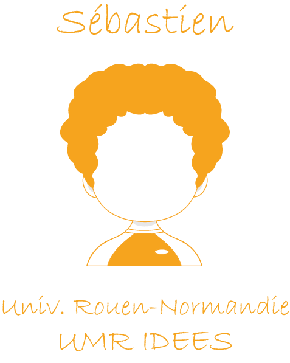


<div id="rightseb">
<ul class="xpucsmall" style="margin-top:50px;">
> - <span style="color:#f7a41f;">Ingénieur de recherche</span>
> - <span style="color:#f7a41f;">Geomatique/Informatique</span>
> - <span style="color:#f7a41f;">Coord. du GT Notebook</span>
> - <span style="color:#f7a41f;">Membre du projet Rzine</span>
</ul>
</div>
</div>

</div>

<aside class="notes">
Un groupe de travail inter-disciplinaire travaillant à un portail de ressources, ouvert, dédié à l'observation théorique et pratique des notebooks
</aside>


# {data-background="figure/logo_notebook2.png" data-background-size="1000px"}

<h2>**Le notebook**</h2>

<br>
<br>
<br>
<br>
<br>
<br>
<br>
<br>
<br>
<br>


## Définition

<p class="medpcenter" style="margin-top:40px;font-size:75%;">**Interface de programmation qui permet de combiner des sections en langage naturel et des sections en langage informatique**</p>

<p class="smallpcenter" style="margin-top:30px;font-size:55%;"><span style="color:grey;"><b>De nombreuses dénominations existent :</span></b></p>

<ul class="pucsmall2" style="margin-top:0px;font-size:50%;">
> - <span style="color:grey;">*Article exécutable*</span>
> - <span style="color:grey;">*Document computationnel*</span>
> - <span style="color:grey;">*Document électronique interactif*</span>
> - <span style="color:grey;">*Bloc-note*</span>
> - <span style="color:grey;">*Cahiers de programmation*</span>
> - <span style="color:grey;">*Cahier électronique d'analyse*</span>
> - <span style="color:grey;">*Calepin électronique*</span>
> - <span style="color:grey;">*Carnet de code*</span>
> - <span style="color:grey;">*Manifeste algorithmique*</span>
> - <span style="color:grey;">**Notebook !**</span>
> - <span style="color:grey;">*...*</span>


</ul>


<p class="medpcenter" style="margin-top:30px;font-size:75%;">**Un notebook permet d'appliquer le paradigme de programmation lettrée, qui facilite le partage, le travail collaboratif et la reproductibilité**</p>


## Une logique... des pratiques


<p style="font-size:60%;">La mise en forme du texte se fait à l'aide d'un langage de balisage (Markdown, html...)</p>

## Anatomie d'un notebook

<p class="smallpcenter" style="margin-top:70px;">Simple fichier texte<P>


## Notebook sans code ?

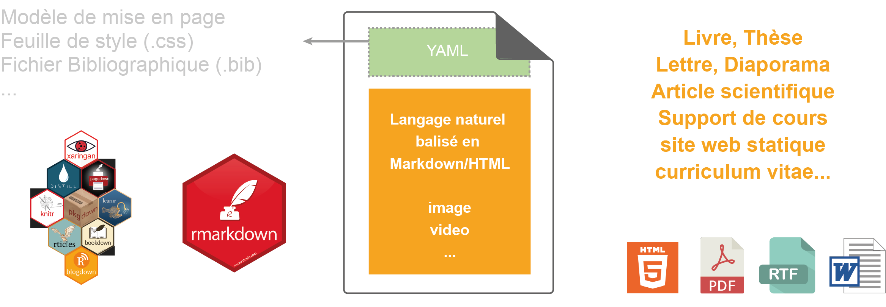

## Stylo d'Human-Num

<p class="smallpcenter" style="margin-top:40px;" >Développé par le [CRC-EN](https://ecrituresnumeriques.ca/fr/) avec le support [Érudit](https://www.erudit.org/fr/) et de la [TGIR Huma-Num](https://www.huma-num.fr/)</p>

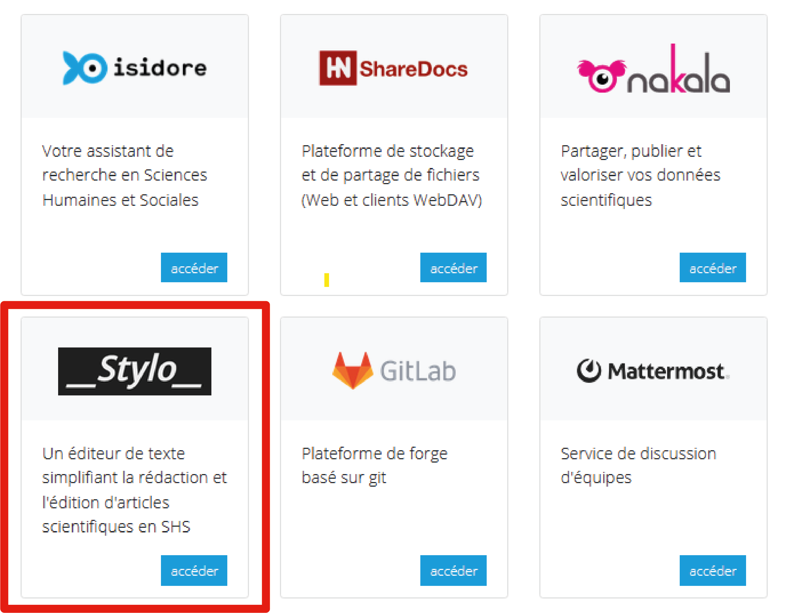

<p class="smallpcenter" style="margin-top:30px;">Sinon, il existe beaucoup d'éditeurs libres ([CodiMD](https://hackmd.io/MVFMDJaVTkKM-s4IUz_q7A?both)...)</p>

## Le Markdown (Gruber, 2004)

<div id="codermd">
<p class="smallpcenter">Fichier Markdown (.md)</p>
```{r, file = 'figure/hackmd.md', eval=FALSE}
```

<p class="smallpcenter">-> Visualiser sur [HackMD](https://hackmd.io/MVFMDJaVTkKM-s4IUz_q7A?both)</p>

</div>

<div id="codehtml">
<p class="smallpcenter">Texte mis en forme (sortie html)</p>
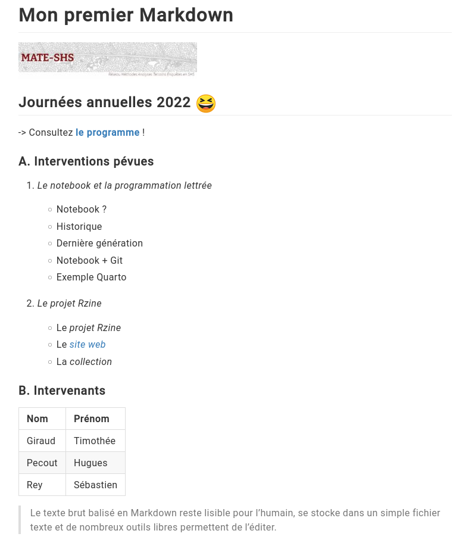
</div>


## Exemple de Notebook

## Le Notebook Rmarkdown

<div id="codermd">

<p class="smallpcenter">Fichier source (.rmd)</p>

```{r, file = 'figure/exemple.rmd', eval=FALSE}
```
</div>

<div id="codehtml">

<p class="smallpcenter">Fichier en sortie (.html)</p>

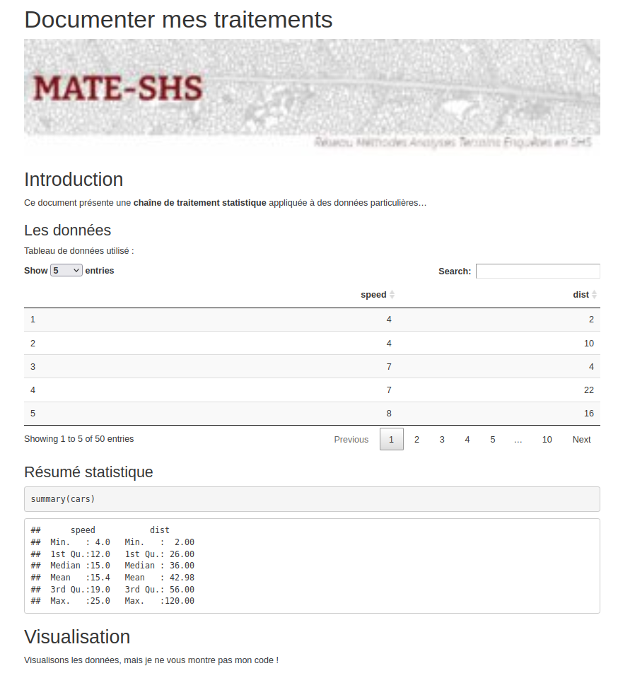
</div>


##  « Kniter »  un .rmd 

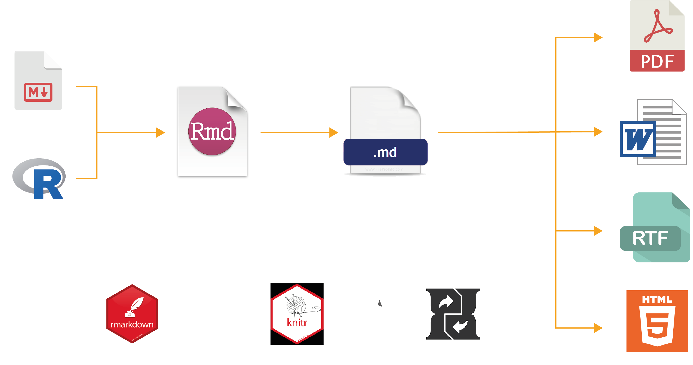

##  {data-background="figure/markdown2.png" data-background-size="1400px"}


##  {data-background="figure/markdown3.png" data-background-size="1400px"}


# {data-background="figure/history.jpeg" data-background-size="750px"}

<br>
<br>
<br>
<br>
<br>
<br>
<br>
<br>
<br>
<br>


## Les prémices


<div id="codermd2">

<p class="medpcenter" style="margin-top:30px;"><span style="color:#f7a41f;">**Ancêtres du notebook :**</span></p>

<ul class="pucsmall22" style="margin-top:20px;">
> - 1970 : Scratchpad (Axiom)
> - 1987 : MathCad 
> - 1988 : Mathematica 
> - 1989 : Maple 
> - 2011 : IPython
</ul>

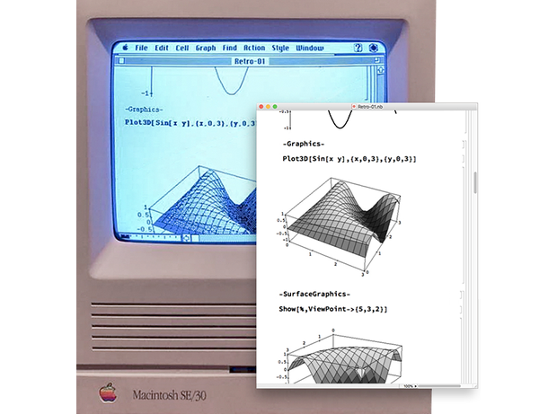


</div>

<div id="codehtml2">

<p class="medpcenter" style="margin-top:30px;"><span style="color:#f7a41f;">**Émergence de la recherche reproductible**</span></p>

<p style="font-size:60%;margin-top:30px;">En 1976, **Jon Claerbout** publie l'ouvrage : <br>
[*Fundamentals of Geophysical Data Processing*](http://sepwww.stanford.edu/sep/prof/fgdp5.pdf)</p>

<p style="font-size:56%;">Cette 1ère version, non-reproductible, sera le début d'un long travail de recherche sur la reproductibilité de ses travaux... Via des notebooks.</p>


<p class="medpcenter" style="margin-top:90px;"><span style="color:#f7a41f;">**Émergence du Literate Programming**</span></p>

<p style="margin-top:20px;font-size:60%;">Le concept de **programmation lettrée** pensé et mis en oeuvre (1977-78) par **Donald Knuth** est lié à l'histoire des notebooks.</span></p> 


</div>


## Programmation lettrée


<p class="smallpcenter" style="margin-top:40px;">La **programmation lettrée** est une approche de la programmation qui se veut différente du paradigme de programmation structurée.</p>

> <p style="font-size:50%;">Instead of imagining that our main task is to instruct a computer what to do, let us concentrate rather on explaining to human beings what we want a computer to do. <br> Donald Knuth, [LP Website citations page](http://www.literateprogramming.com/)</p>

> <p style="font-size:50%;">The practitioner of literate programming (...) strives for **a program that is comprehensible because its concepts have been introduced in an order that is best for human understanding** (...). <br> Donald Knuth, [LP Website citations page](http://www.literateprogramming.com/)</p>


<p class="smallpcenter">**Le paradigme de la programmation lettrée**, tel qu'il a été conçu par **Knuth**, s'éloigne dans son écriture de l'ordonnancement imposé par l'ordinateur, et à la place **autorise les développeurs à utiliser un ordre imposé par la logique et le fil de leur pensée**.</p>


## Multiplication des NB et des plateformes

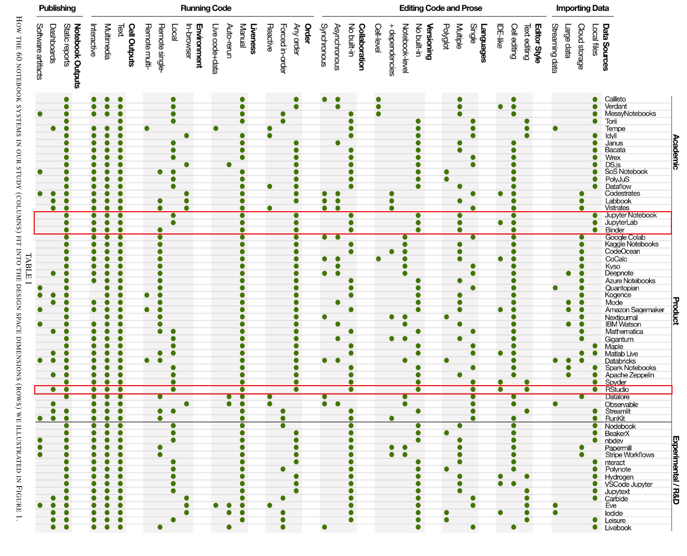

<p style="font-size:40%;color:grey;margin-top:5px;">S. Lau, I. Drosos, J. M. Markel and P. J. Guo, "The Design Space of Computational Notebooks: An Analysis of 60 Systems in Academia and Industry," 2020 IEEE Symposium on Visual Languages and Human-Centric Computing (VL/HCC), 2020<p>


## Dernière génération

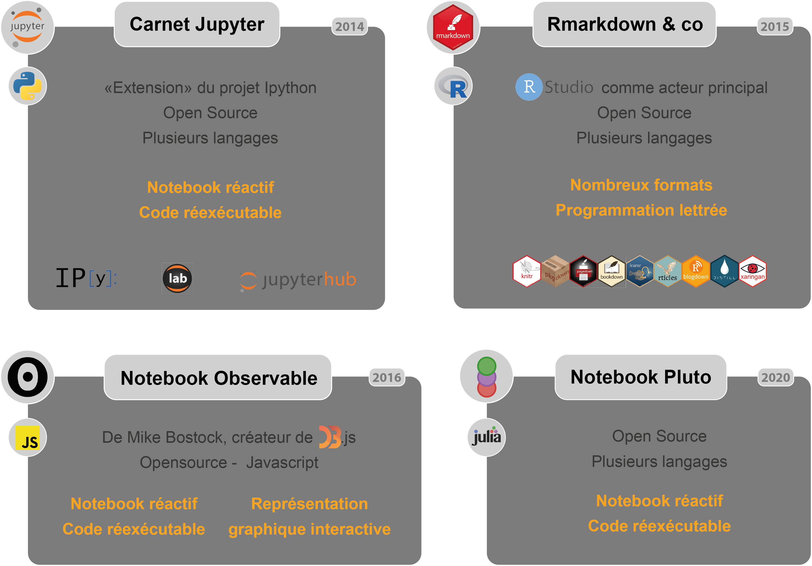


## 2022, l'année  


<p class="smallpcenter">[**Quarto**](https://quarto.org/) permet l'utilisation de **R**, **Python**, **Julia**, **Javascript** (**OJS**)...</p>


## Programmation lettrée & Notebook 

<br>
 
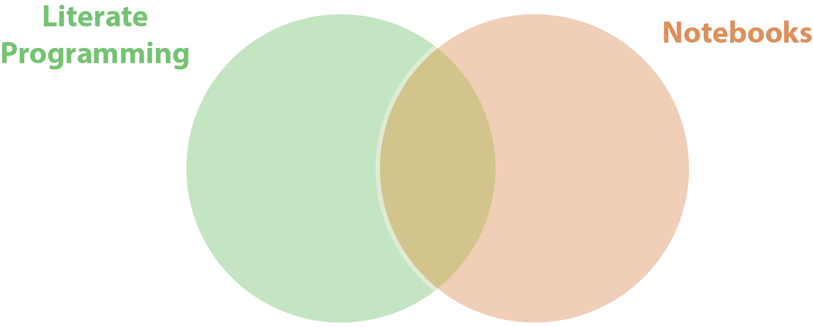

## LP, Notebook & Reproductibilité

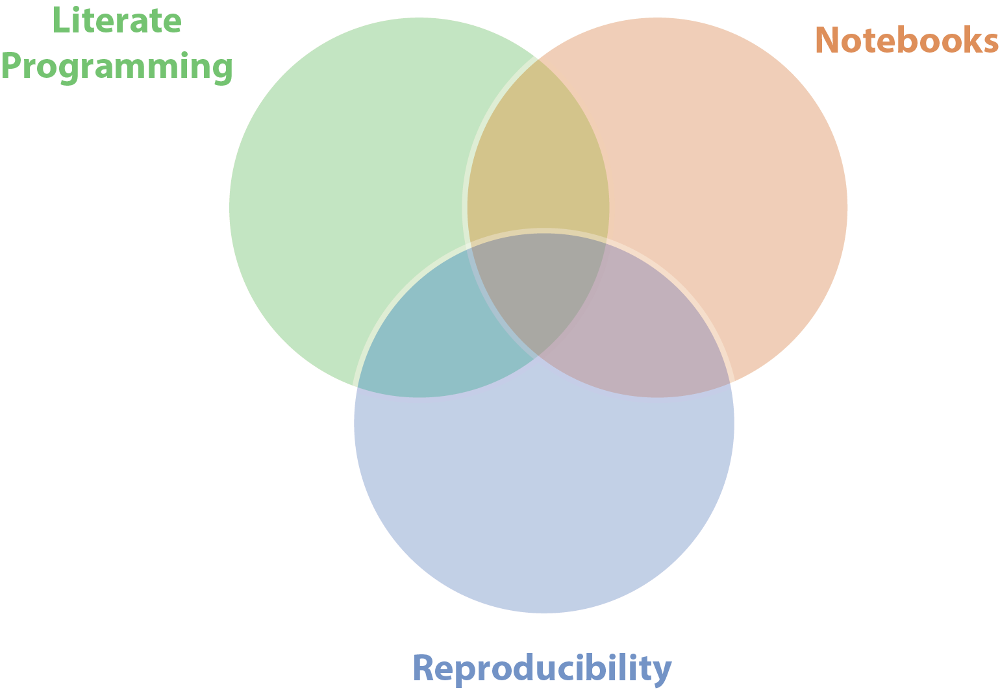 
 

# {data-background="figure/partie4.png" data-background-size="500px"}

<br>
<br>
<br>
<br>
<br>
<br>
<br>
<br>
<br>
<br>


## Git, GitHub, GitLab


<p class=smallpcenter" style="margin-top:80px;font-size:85%;">[**Git**](https://git-scm.com/) est un système de gestion de version distribué pour :</p>  

<ul class="pucsmall22"style="margin-top:10px;font-size:77%;">
> - tracker les changement dans les fichiers texte         
> - gérer l’historique du code source       
> - partager le code dans des dépots distants       
</ul>

<br>
<br>
<p class=smallpcenter" style="margin-top:40px;font-size:83%;">[**GitHub**](https://github.com/) et [**GitLab**](https://about.gitlab.com/) hébèrgent des dépots distants et des services pour gérer des projets (issue tracker, collaboration, hébergement web, CI/CD).</p>  


## Notebook + Git 

<ul class="pucsmall22"style="margin-top:60px;font-size:85%;">

<li>Les sources des notebooks sont des fichiers texte</li> 

  <ul class="pucsmall22"style="margin-top:15px;font-size:95%;">
➡️ Suivi des modifications (*commit*, branches, etc.)
   </ul>  
  
<li style="margin-top:70px;">Certains ont besoin d'être compilé</li>   

  <ul class="pucsmall22"style="font-size:95%;margin-top:15px;">
➡️ *Continuous Integration*  
  </ul>      
    
<li  style="margin-top:70px;">Certains peuvent être déployés sur le web</li>   

  <ul class="pucsmall22"style="font-size:95%;margin-top:15px;">
➡️ *Continuous Deployment* 
  </ul>  
    
</ul>  


## Exemple notebook Quarto

<br>
<br>
<br>

 **+**  **+**  **+**  **+**  

<br>
<br>
<br>

<p style="font-size:115%;">[Cliquez-ici !](https://rcarto.github.io/Quarto/)</p>


# {data-background="figure/ccl.png" data-background-size="1000px"}

<br>
<br>
<br>
<br>
<br>
<br>
<br>
<br>
<br>
<br>


## Conclusion

<div id="leftt">
<p style="margin-top:70px;font-size:90%;">Un **format de publication**<br> scientifique légitime</p> 

<ul class="pucsmall22" style="margin-top:60px;font-size:81%;">
> - [Rzine](rzine.fr), pour la pratique de R en SHS      
> - [Computo](https://computo.sfds.asso.fr/) de la SFdS    
> - [Programming Historian](https://programminghistorian.org) 
> - ...
</ul>  
</div>  
  
  
<div id="rightt"> 
<p style="margin-top:70px;font-size:90%;">Nombreux templates,<br>**multiples usages**</p> 

<ul class="xpucsmall" style="margin-top:23px;font-size:62%;">
      > - <span style="color:grey;">*Article*</span>  
      > - <span style="color:grey;">*Manuel*</span>    
      > - <span style="color:grey;">*Rapports*</span>   
      > - <span style="color:grey;">*Livre*</span>  
      > - <span style="color:grey;">*Tutoriel*</span>
      > - <span style="color:grey;">*Cours - Exercice*</span>
      > - <span style="color:grey;">*Blog - Site web*</span>   
      > - <span style="color:grey;">*curriculum vitae*</span>   
      > - <span style="color:grey;">*Diaporama*</span> 
      > - <span style="color:grey;">*...*</span> 
</ul>  
</div> 


## Ceci est un notebook...

```{r, echo=TRUE, eval=TRUE, warning=FALSE, message=FALSE}

# Chargement des librairies
library(sf)
library(leaflet)

# Création d'un point (localisation centre des colloques)
ptsfg <- st_point(c(2.36652, 48.9071886))
ptsfc <- st_sfc(ptsfg, crs = (4326))
ptdf <- data.frame(id= 1, name = "Vous êtes ici !")
Here <- st_sf(ptdf,geometry = ptsfc)


# Affichage du point - carte interactive
mamap <- leaflet(Here, width = 950, height = 550) %>%
  addTiles() %>%
  addMarkers(data = Here, popup = "❤️mate-shs❤️")
```


## Vous êtes ici !

```{r, echo=FALSE}
mamap
```

## Merci de votre attention

<br>
<p style="margin-top:0px;margin-bottom:0px;font-size:100%;">**Diapositives libres** (CC BY-SA 4.0)</p>
<p style="margin-top:10px;margin-bottom:0px;font-size:65%;">Slides : https://huguespecout.github.io/notebook_mateshs/#/</p>
<p style="margin-top:5px;margin-bottom:0px;font-size:65%;">Code source : https://github.com/HuguesPecout/notebook_mateshs</p>


<br>
<p style="margin-top:30px;margin-bottom:10px;font-size:100%;">**Contact**</p>
<p style="margin-top:10px;margin-bottom:0px;font-size:70%;">hugues.pecout@cnrs.fr</p>
<p style="margin-top:5px;margin-bottom:0px;font-size:70%;">timothee.giraud@cnrs.fr</p>
<p style="margin-top:5px;margin-bottom:0px;font-size:70%;">sebastien.rey-coyrehourcq@univ-rouen.fr (GT Notebook)</p>

<br>
[](https://gitlab.huma-num.fr/rzine/site)@rzine_shs


## Info session

<br>

```{r, echo=FALSE, eval=TRUE}

sessionInfo()


```  
  
